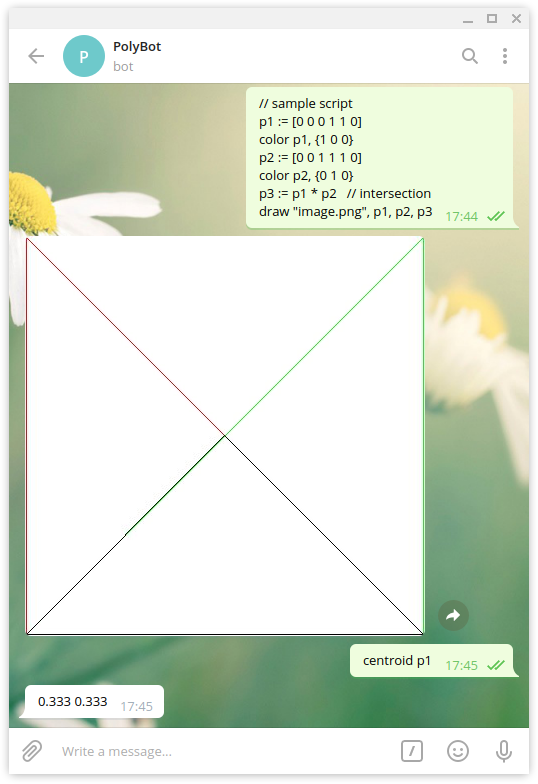

# Pràctica de python PolyBot

La pràctica consisteix a crear un bot de Telegram que serveixi com intèrpret d'un llenguatge de programació 
per treballar amb polígons convexos.

## Índex

  - [Prerequisits](#prerequisits)
  - [Instal·lació](#instal·lació)
  - [Usage](#usage)
  - [Decisions preses](#decisions preses)  
  - [Crèdits](#crèdits)

## Prerequisits

Tenir instal·lat [Python 3](https://www.python.org/).


## Instal·lació

Per instal·lar els requeriments, executeu la següent comanda.
```bash
python3 -m pip install -r requirements.txt
```
Crea un [bot de telegram](https://core.telegram.org/bots#3-how-do-i-create-a-bot) i copia el seu token a /polybot/Config.py

## Usage

Per posar en marxa el bot, executeu la següent comanda dins de la carpeta bot.
```bash
python3 bot.py
```

Visiteu aquest [enllaç](http://t.me/miquelangel99PolyBot) que us redirigirà a Telegram i entrareu en una conversa 
amb el bot. Doneu-li la comanda **/start** (o piqueu el botó **Inicia'l**).


Exemple d'execució




## Llenguatge

### Comentaris
Les dues barres (`//`) indrodueixen a comentari fins al final de la linea.

### Identificadors de polygons

Els identificadors són les cadenes de caràcters formades per les lletres de l'alfabet anglès, dígits, i el caràcter `_`,
que comencen per una lletra. Aquests són alguns exemples d'identificadors: `p`, `Q`, `p1`, `p2`, `pol_gr`.

### Punts i poligons

Els punts en les comendes són un parell de nombres reals, en notació estàndard, per indicar les coordenades X i Y.
Per exemple, "0 0" o "3.14 -5,5 '. Quan s'imprimeix, tots els nombres reals s'han de formatar amb tres dígits després 
del punt decimal.

### Colors

Els colors en les comandes són tripletes de nombres reals en l'interval [0,1] envoltats per `{''}` que indiquen 
la representació RGB d'un color. Per exemple, `{0 0 0}` és negre, `{1 0 1}` vermell, i `{1 0.64 0}` taronja.

### Comanda d'asignasio

La comanda d'assignació (`:=`) associa una variable amb un polígon convex.

### La comanda `print`

La comanda `print` imprimeix un polígon o text.
- Per polígons, la sortida és els vèrtexs del convex hull del polígon en sentit horari començant pel de mes a l'esquerra i a baix.
- Per text, el text és una cadena de caràcter (simples) entre `"`.

### La comanda `area`

La comanda `area` imprimeix l'àrea del polígon donat.


### La comanda `perimeter`

La comanda `perimeter` imprimeix el perímetre del polígon donat.


### La comanda `vertices`

La comanda `vertices` imprimeix el nombre de vèrtexs del polígon donat.


### La comanda `centroid`

La comanda `centroid` imprimeix el centroide del polígon donat.


### La comanda `color`

La comanda `color` associa un color a una variable de polígon.


### La comanda `inside`

Donat dos polígons, la comanda `inside` imprimeix `yes` o `no` depenent si el primer polígon està dins del segon.

### La comanda `equal`

Donat dos polígons, la comanda `equal` imprimeix `yes` o `no` depenent si els dos polígons són iguals.

### La comanda `draw`

La comanda `draw` dibuixa una llista de polígons en un fitxer PNG, cada polígon amb el seu color associat.

### Operadors

`*` representa la intersecció entre dos polígons.

`+` representa la unió convexa de dos polígons.

`#` és l'operador unari que retorna la caixa mínima contenidora del polígon.

`!n` és un operador que aplicat a un nombre natural `n` retorna un polígon convex format a partir de `n` punts 
aleatoris en [0, 1]².


## Decisions preses

- Considero que el centroid del polígon buit és el punt (0, 0).
- Considero que el polígon buit no està dins de cap polígon.
- Considero que tot polígon amb menys de 3 vèrtexs és regular.
- L'algorisme de intersecció de dos polígons convexos és l'explicat en el llibre 
  [Computational Geometry in C](http://www.science.smith.edu/~jorourke/books/compgeom.html)
  de Joseph O'Rourke.
- Considero que la intersecció (`*`) té preferència a la unió (`+`).
- Considero que la bounding box del polígon buit és un polígon buit.
- Considero que la bounding box d'un monogon és un monogon amb el mateix vèrtex.
- Els polígons es dibuixen en el requadre 398x398 central de la imatge de 400x400, 
  i considero que l'origen és l'extrem inferior esquerre d'aquest requadre.

## Crèdits
 - Miguel Angel Malqui Cruz